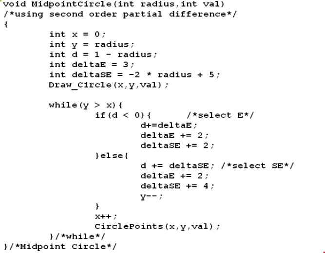
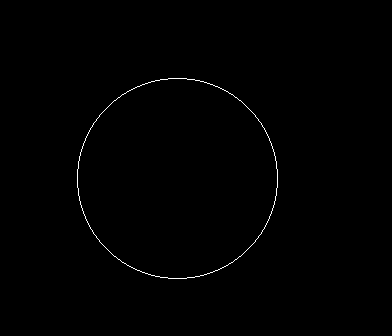
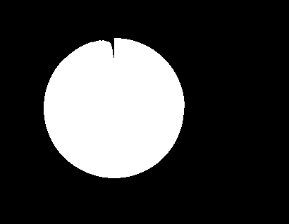
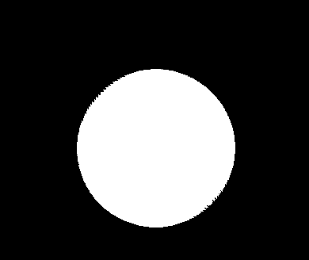

# Analysis - Drawing a Circle

## Brief Documentation of the algorithm

The midpoint circle algorithm is used to determine the points needed for rasterizing a circle. It makes use of the fact that a circle has 8-way symmetry. Using certain imporivements and optimizations, we can implement this
algorithm using only integer calculations, instead of real calculations.
Basically, the algorithm calculates a decision variable to decide which point to render next.

Reference for detailed algorithm: https://en.wikipedia.org/wiki/Midpoint_circle_algorithm#cite_ref-HearnBaker1994_1-0

## Algorithm Used

## Example Output

- 100 unit radius circle

- 1 unit radius circle

## Timing

- Drawing a circle of radius ~10 takes less than 1ms. Drawing a circle of radius 10,000 units takes around 0.01 seconds ( per frame ).

- Drawin 10,000 circles of 10 unit radius takes around 0.01 seconds ( per frame).

- Drawin 10,000 circles of 1000 unit radius takes around 1 second ( per frame).

- Drawin 10,000 circles of 1000 unit radius takes around 1 second ( per frame).

- Drawin 100,000 circles of 1000 unit radius takes around 10-15 second ( per frame).

Times were calculated on an Intel i7-7700HQ Processor.

## Problems faced

We tried to fill the circle with a color. We tried using Open GL `GL_POLYGON` in `GLBegin()`
and fill it with a color. However, the filled circle was not accurately filled by OpenGL.

This was because Open GL was not able to detect the shape of the convex polygon properly as a circle has too many edges. Using `GL_TRIANGLES` fixed that.

