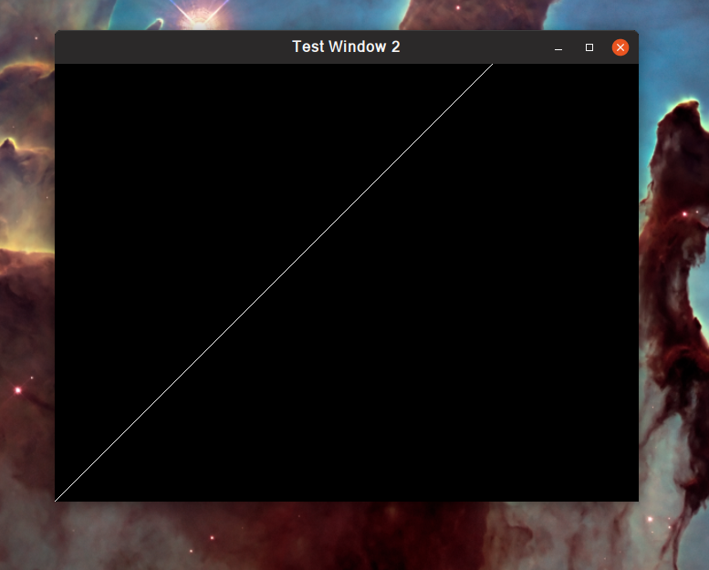

# Developer guide for debian-based systems.

1. Add this ppa `deb http://ppa.launchpad.net/keithw/glfw3/ubuntu trusty main`
1. Execute these commands
   ```bash
   sudo apt-get update
   sudo apt-get install libglfw3
   sudo apt-get install libglfw3-dev
   ```
1. `glfw` headers will become available at `/usr/include/GLFW/glfw3.h`
1. Compile using `g++ beautifulTrees.cpp -lglfw -lGLU -lGL`
1. Run as `./a.out`

### Screenshot ( as of 0d0603cf7)


