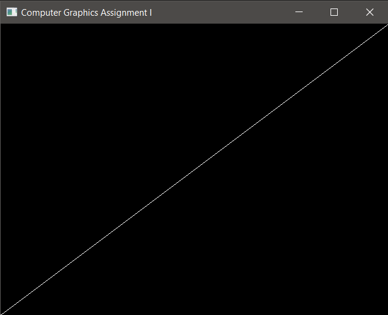

# Line Drawing



## Explanation of the algorithm
Lines are drawn using the `drawLine` method having the following declaration: ```void drawLine(int x1, int y1, int x2, int y2)```.

The algorithm is simply **Bressenham's Midpoint Line Drawing Algorithm**. The core of the algorithm always expects endpoints _(x1, y1)_ and _(x2, y2)_ in the first quadrant with the slope between 0 and 1. The function therefore translates any coordinate into the first quadrant with slope between 0 and 1.

The following piece of psuedo-code illustrates ensuring slope is between 0 and 1 by simply reflecting the endpoint coordinates about the line _y=x_ if slope is greater than 1.
```
if abs(y2 - y1) > abs(x2 - x1)
{
	swap:= x1, y1
	swap:= x2, y2
}
```

For negative slopes, we do two things:
1. If _x1 > x2_, we swap the starting and ending coordinate pairs.
2. If _y2 - y1 < 0_, we decrement values of y when drawing pixels (since _y_ decreases with increasing _x_)

## Timing Analysis
We used the `chrono` library to time the drawLine method using. The method call used was:
`drawLine(0, 0, 640, 480);`. Our view port was 640x480 pixels. Hence, such a draw call would be computationally more expensive due the to the number of length of the line segment. 

However, even with a high resolution, millisecond clock, we were the time taken for each function call was stil 0 seconds. We took the average time taken to draw the same line 10,000 times in the same frame, which came out to be around 634 milliseconds. This equates to around 0.0634 milliseconds per cll.

## References
**Tidier Drawings of Trees Author** _Edward M. Reingold and John S. Tilford_
Journal: IEEE Transaction on Software Engineering, Vol-7, Issue-2, 1981.


