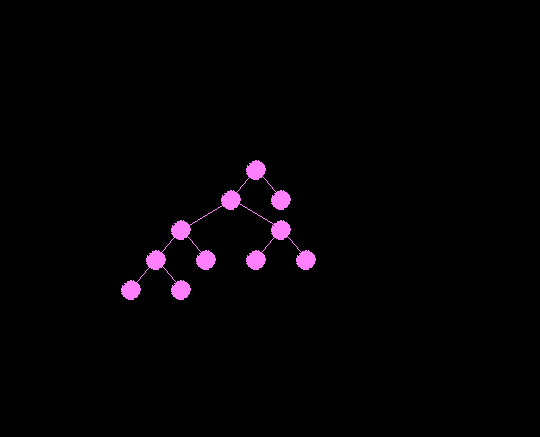
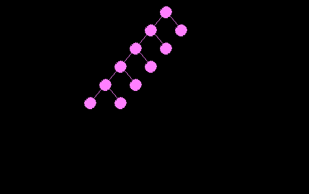
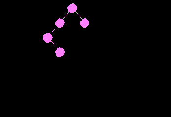

# Analysis - Drawing an aesthetic binary tree.

## About of the algorithm used

We have used the algorithm proposed in "Tidier Drawings of Trees Author: Edward M. Reingold and John S. Tilford
Journal: IEEE Transaction on Software Engineering, Vol-7, Issue-2, 1981." to implement our
assignment.

We use 4 aesthetics to determine the "beauty" of a tree:

Aesthetic 1: Nodes at the same level of the tree should lie
along a straight line, and the straight lines defining the levels
should be parallel.

Aesthetic 2: A left son should be positioned to the left of
its father and a right son to the right.

Aesthetic 3: A father should be centered over its sons.

Aesthetic 4: A tree and its mirror image should produce
drawings that are reflections of one another; moreover, a sub-
tree should be drawn the same way regardless of where it
occurs in the tree.

This algorithm produces pleasing drawings of binary trees in general.
Although the drawings can be wider than the minimum
possible under the four aesthetics; this is unavoidable, how-
ever, because Supowit and Reingold [2] have shown that
determining the minimum width under these aesthetics is
NP-hard.

## Example outputs

## Timing Analysis

- For a tree with a single node, it takes less than 10^-3ms, per frame.

- For a tree with ~30 nodes, it takes around 0.3ms per frame.

- For a tree with 3 nodes, and drawing 100,000 such trees in a single frame, it takes 0.6 seconds per frame.

This was done on an Intel i7-7700HQ Processor.

## Problems faced during development

- One of the problems was slopes of the lines connecting the nodes. The standard mid-point algorithm taught wasn't working for all slopes, and a lot of time was spent on fixing that.

- Understanding the research paper itself took a lot of time, apart from implementing the algorithm.

- Taking input interactively was also one of the discussion points for us.

- We wanted to fill the circles, but that wans't easy. This problem has been discussed in the [Circle Page](CIRCLE.md)
